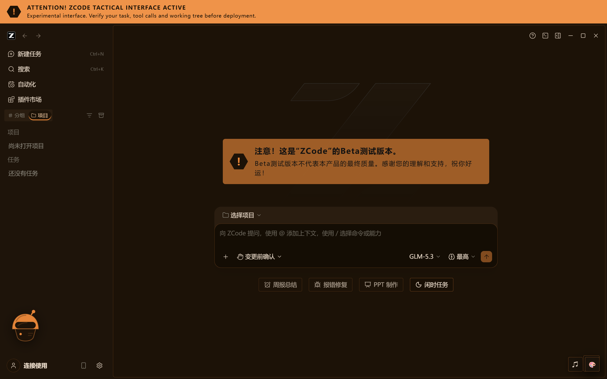
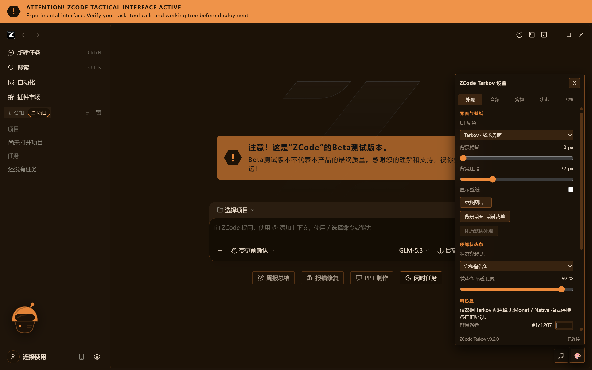
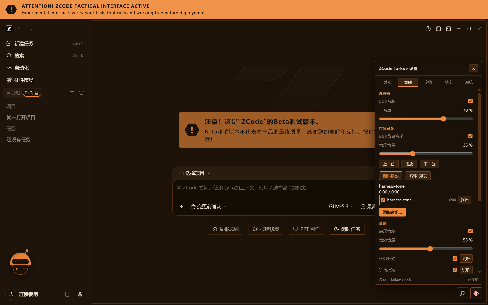
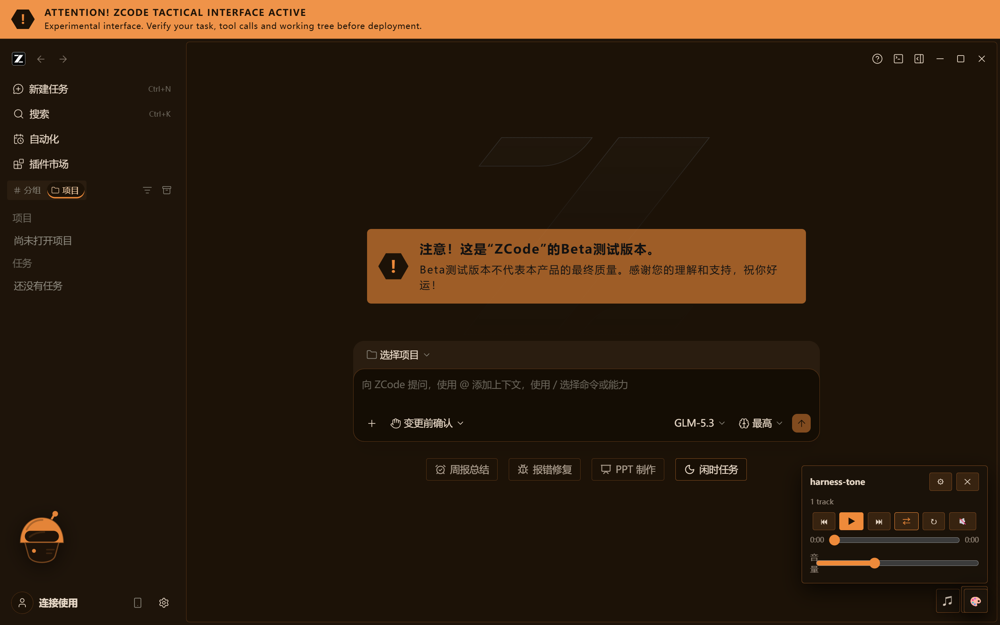
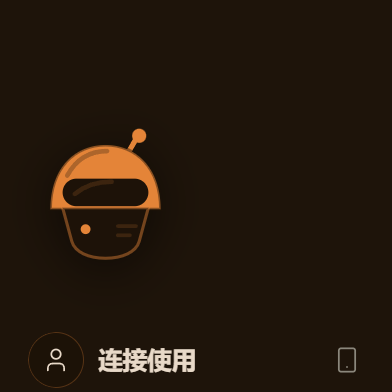
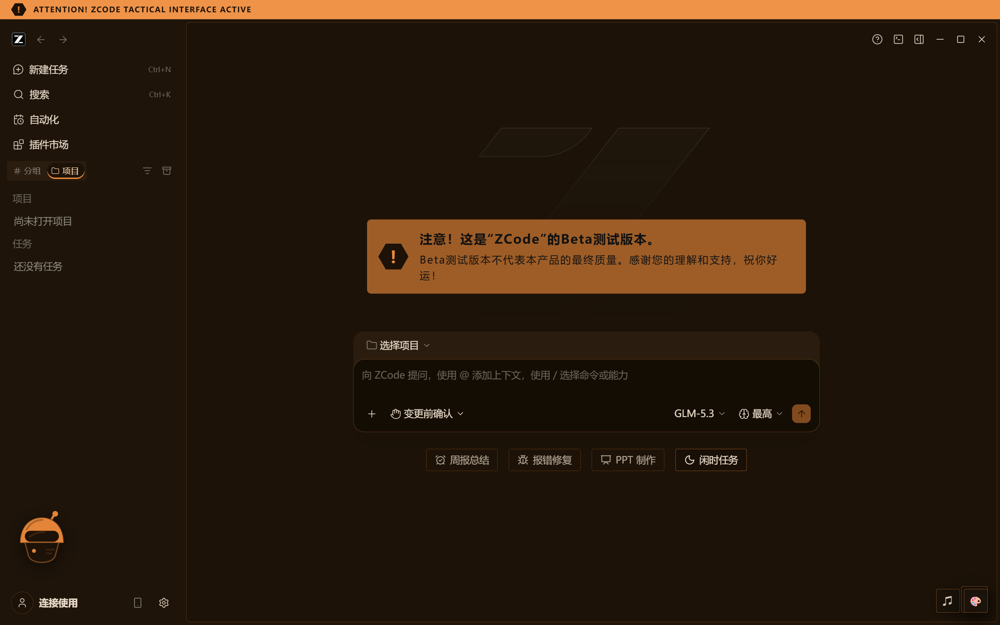
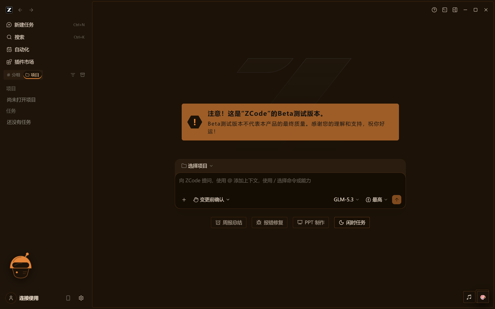
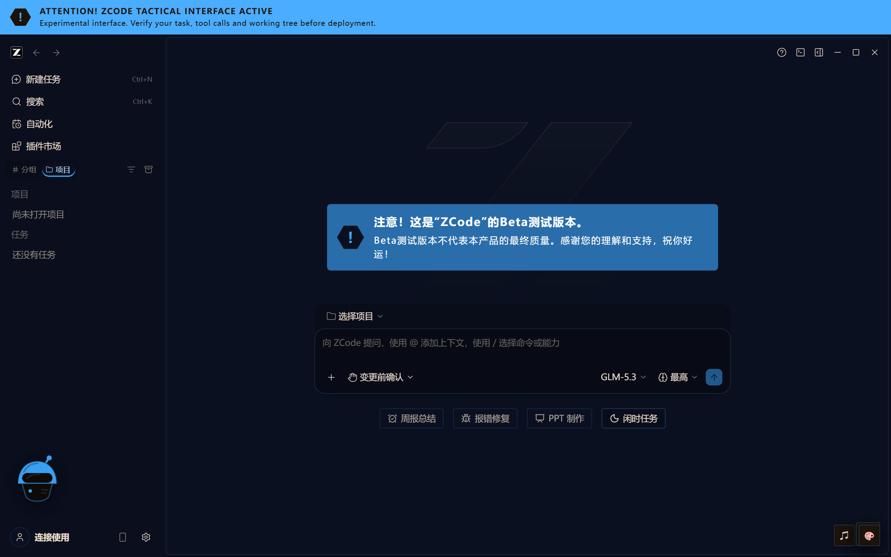
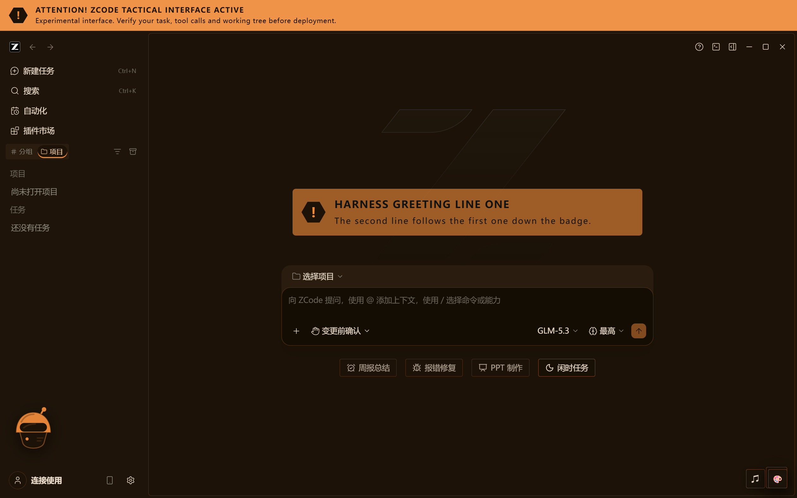

# zcode-tarkov

**为 ZCode 桌面客户端打造的 Tarkov 风格界面层** —— 一套温暖的战术配色、一条测试版警示带、带悬浮条播放的背景音乐、事件音效、一只可拖动的桌宠，以及一行随机轮换的运行状态文案，全部由应用内的设置中心驱动。

[](#)
[](LICENSE)
[](#zcode-updates--compatibility)
[](#disclaimer)



> **非官方项目。** 与 ZCode 没有隶属关系，也与 Battlestate Games 没有隶属关系。《Escape from Tarkov》仅作为视觉风格参考。**本项目不附带任何游戏美术、音频或其他素材** —— 详见 [免责声明](#disclaimer)。

---

## zcode-tarkov 是什么

ZCode 桌面客户端是一个 Electron 应用，所以可以在不碰安装目录里任何一个文件的前提下，从外部接管它的界面。本项目用 DevTools 协议把一份样式表和一个很小的客户端程序注入正在运行的渲染进程，再用一个本机服务保存设置、串流你的音频，并记住你的选择。

v0.1 是一个**主题**：固定的 Tarkov 调色板、组件样式、一张壁纸和一条测试版警示带。v0.2 是一个**界面层**：主题之外，还有音频、一只桌宠、一条状态旁白，以及驱动这一切的设置中心。

它从不修改 ZCode。它写入的每一个字节都存放在你自己的用户目录里，而卸载只需要一条命令，默认不会动你的媒体和设置。

## 功能

- **Tarkov 视觉主题** —— 一套固定的暖色调色板，映射到 ZCode 自己的语义 token 上，再加一层轻量的组件皮肤（直角容器、细强调色边框、强调色的活动行指示）。它与壁纸相互独立，所以换背景永远不会改变你的界面配色。
- **三种配色模式** —— `Tarkov`（固定调色板）、`Monet`（从你的壁纸重新取色）、`Native`（ZCode 原样不动）。可实时切换。
- **壁纸层**，支持模糊、压暗，以及 `cover` / `contain` / `smart` 三种填充方式。
- **顶部战术警示带** —— 测试版警告，三种模式：`full`、28 px 的 `compact` 细条，或 `off`。关闭会移除它，*同时*释放它预留的空间。
- **事件音效** —— `start`、`approval`、`done`、`error`、`tool`。以*合成音*内置，可以逐个文件替换。
- **背景音乐** —— 你自己的文件，以字节范围寻址的方式串流，带一个小悬浮条、随机播放、循环，以及每首曲目的单独开关。
- **一只可拖动的桌宠**，点击时会随机出一句语音，默认是原创 SVG，也可以换成你丢进去的任何图片。
- **随机轮换的运行状态文案**，取自一个可编辑的短语池。
- **可以重新配色的调色板** —— 自己挑一个背景色和一个强调色；面板、浮层和文字颜色都由它们推导出来，所以结果始终协调，浅色背景会自动配深色文字，而不是留下读不清的浅色字。
- **可编辑的欢迎界面文字** —— ZCode 空会话界面上那条测试版提示就是你自己写的内容，并且可以整个关掉。
- **一个设置中心**，包含 外观 / 音频 / 桌宠 / 状态 / 系统 五个分类。

## 截图

| | |
|---|---|
|  |  |
| **设置 · 外观** —— 配色模式、壁纸，以及警示带开关 | **设置 · 音频** —— 总开关、背景音乐、逐事件音效、语音 |
|  |  |
| **背景音乐悬浮条** —— 一行标题、播放控制，以及音量 | **桌宠** —— 可拖动，右键打开它的菜单 |
|  |  |
| **精简警示带** —— 保留警告，不占地方 | **警示带关闭** —— 应用拿回它完整的高度 |
|  |  |
| **自定义调色板** —— 警示带和注入的界面都会跟随强调色 | **自定义欢迎文字** —— 用你自己的措辞 |

*所有截图都是从一台隔离的 ZCode 实例上真实截取的，不是效果图 —— 见[开发](#development)。*

## 安装

**简版：** 在 ZCode 的插件市场里把本仓库添加为一个市场（marketplace），安装 **zcode-tarkov**，然后运行一次安装脚本，就得到启动器和常驻服务。

```powershell
git clone https://github.com/BakaronLab/zcode-tarkov
cd zcode-tarkov
powershell -NoProfile -ExecutionPolicy Bypass -File .\install.ps1
```

然后**彻底退出 ZCode**（包括托盘图标），再从新出现的 **"ZCode Tarkov"** 快捷方式重新启动它。这次重启只需要做一次：ZCode 只在启动时读取 `--remote-debugging-port`，所以一个已经在运行的实例不会凭空长出被注入的能力。

环境要求：Node.js 20 或更高版本，以及安装在标准位置的 ZCode。安装脚本不需要管理员权限。

如果你是替别人安装的 AI 智能体，请改为阅读 [`INSTALL-FOR-AI.md`](INSTALL-FOR-AI.md) —— 里面有安全规则，以及面向非技术用户的路径。

## 日常使用

平时照常从 **ZCode Tarkov** 快捷方式启动 ZCode 即可。常驻服务会自动把主题恢复回来，所以第一次启动之后什么都不用做。应用内右下角有两个控件：

- **⚙ 按钮** 打开设置中心；
- **♫ 按钮** 打开背景音乐悬浮条。

两个都可以移动：设置窗口可以拖它的标题栏，桌宠可以直接拖自己。

在终端里：

```powershell
$cli = "$env:LOCALAPPDATA\Programs\zcode-tarkov\dist\cli.js"
node $cli status            # 调试端口能连通吗？
node $cli theme tarkov      # 不打开面板就切换调色板
node $cli recovery always   # 让常驻服务随登录启动
```

## 文件放在哪里

这里回答的是"我的音乐到底放哪"。下面这些东西都属于你，而且**卸载默认不会动其中任何一项**，除非你主动要求。

| 路径 | 放什么 |
|---|---|
| `%LOCALAPPDATA%\zcode-tarkov\data\music\` | **背景音乐。** `mp3`、`wav`、`ogg`、`m4a`、`aac`、`flac`、`webm` |
| `…\data\sounds\` | **覆盖内置音效。** 用事件名给文件命名即可替换：`start.*`、`approval.*`、`done.*`、`error.*`、`tool.*` —— 任意受支持的扩展名，按文件名主干匹配 |
| `…\data\voice\` | **点击桌宠时播放的语音片段。** 随机选一个 |
| `…\data\pet\` | **桌宠的图片。** `pet.png`、`pet.webp`、`pet.gif`、`pet.jpg`、`pet.jpeg` —— 按这个顺序取第一个匹配到的 |
| `…\data\status\` | **你自己的状态文案。** `texts.zh.txt` 和/或 `texts.en.txt`，一行一条短语，`#` 表示注释 |
| `…\data\prefs.json` | **所有设置项。** 可以直接手改；文件格式出错时会被挪到一边，并恢复默认值 |

用资源管理器或 Finder 把文件丢进去就行 —— 没有导入步骤，没有需要重建的索引，也不用重启。曲库*就是*这个文件夹的文件列表。

在 macOS 和 Linux 上，根目录分别是 `~/Library/Application Support/zcode-tarkov/data` 和 `~/.local/share/zcode-tarkov/data`。

## 音频

### 音效

五个事件，每个都有独立的开关、音量，以及可选的覆盖文件：

| 事件 | 触发时机 |
|---|---|
| `start` | 一轮对话开始 |
| `approval` | ZCode 需要你批准某件事 |
| `done` | 一轮对话结束 |
| `error` | 一轮对话失败或被中断 |
| `tool` | 有工具调用被渲染出来（最吵的那个 —— 它的开关在面板里） |

**没有内置任何音频。** 默认音效是在播放时用振荡器加一小段噪声实时合成的 —— 刻意做得短、闷、不像音乐，因为一个比它所提示的事件活得更久的声音只是噪音。想用你自己的，就把按事件命名的文件放进 `data\sounds\`。

### 自动播放，以及为什么音频一开始是锁定的

Chromium 禁止在你与页面产生交互之前启动音频，被注入的脚本也不例外。在你第一次点击之前，悬浮条上会显示一把锁，设置中心则提供 **启用音频** 按钮。你在窗口里*任意位置*的第一次点击就会为本次会话解锁，所以实际上点一下悬浮条或桌宠就够了。这里刻意没有重试循环，因为重试循环正是这条策略要防的东西。

## 背景音乐

悬浮条上只有一行标题、播放控制、进度条和音量滑块；其余的一切都在 **设置 → 音频** 里，因为一个膨胀成媒体管理器的悬浮条，就是一个会挡住你干活的悬浮条。

- **可以拖进度。** 曲目用 HTTP 字节范围串流，而不是先整体解码，所以一个五分钟的文件在几百 KB 之后就能开始播放，进度条移动到的也是字节偏移。
- **随机播放**从一个洗好的袋子里抽曲，而不是每次独立随机抽一首，所以曲库很小的时候，一首歌不会在其它歌都放完之前重复。
- **只有一个渲染进程负责播放。** ZCode 可以开好几个窗口；它们通过选举决定由谁拥有播放权，其它窗口则保留一个功能完整的悬浮条，把命令转发过去。如果播放方死掉，会自动有另一个接手。

## 桌宠

一个可以拖到任何地方的小家伙。默认是一个**原创的内联 SVG 头盔**，为本项目绘制。把你自己的图片放进 `data\pet\` 就能替换它 —— `png`、`webp`、`gif` 或 `jpg`。

- 用鼠标拖动它。位移小于 5 px 的算*点击*，不算拖动，会从 `data\voice\` 里随机播放一段语音（如果有的话）。
- 它会记住你把它放在哪，并限制在屏幕范围内。
- **右键**弹出一个小菜单：静音语音、隐藏桌宠、重置位置，或打开它的设置。
- 语音文件夹是空的意味着安静，而不是报错。

## 状态文案

在一轮对话运行期间，状态行可以显示一句 Tarkov 味道的文案来替代 ZCode 自己的文案，并随着对话推进不断重抽。在 `data\status\texts.zh.txt` 或 `texts.en.txt` 里写你自己的短语池：

```
# lines starting with # are comments
正在检查撤离路线……
正在整理战术背包……
```

**这一项默认是关闭的。** ZCode 3.12.3 没有在承载运行状态文案的元素上暴露任何稳定属性 —— 调查记录在 [`docs/dev/zcode-runtime-signals.md`](docs/dev/zcode-runtime-signals.md) —— 所以接管只能靠结构定位，无法证明它在每个构建上都安全。与其提供一个默默匹配不到任何东西的选择器，这个功能做成从 **设置 → 状态** 手动开启，并在那里明确标注。当它找不到那一行时，它什么都不做；而且你的原生状态文案在 DOM 里永远不会被修改 —— 只是被覆盖绘制。

## 设置

| 分类 | 里面有什么 |
|---|---|
| **外观** | 配色模式、壁纸、模糊、压暗、填充方式、顶部警示带的模式和透明度、**调色板**（背景色与强调色），以及**欢迎界面文字** |
| **音频** | 总开关与主音量、启用音频按钮、背景音乐播放控制和曲库（添加、删除、启用/停用、上传进度）、逐事件音效开关与试听按钮，以及语音池 |
| **桌宠** | 启用、大小、透明度、点击时播放语音、重置位置 |
| **状态** | 启用、语言、哪些事件会重抽文案、重新加载文案池 |
| **系统** | 服务与 CDP 状态、版本、数据目录、素材目录、修复提示 —— PID 和运行时长在*高级诊断*里 |

## 工作原理

```
ZCode Tarkov shortcut
  └─ launcher (VBS -> PowerShell)  starts ZCode with --remote-debugging-port
       └─ resident service (node, 127.0.0.1:9223)
            ├─ injects CSS + client into every renderer over CDP
            ├─ serves the control API (settings, library, streaming)
            └─ re-injects whenever ZCode restarts
```

- **注入，而不是打补丁。** 用 `Page.addScriptToEvaluateOnNewDocument`，加上一次立即执行的 `Runtime.evaluate`，所以渲染进程重新加载后回来依然是主题化的。
- **客户端是真正的 TypeScript。** `src/client/` 由 esbuild 打包成一个自包含的 `dist/client.js`，再以字符串形式注入 —— 有类型检查，其中的纯逻辑部分（事件状态机、leader 租约、LRU、短语池）都有单元测试。
- **主题化靠 CSS 自定义属性**，映射到 ZCode 自己的语义 token 上。功能性颜色（`success`、`warning`、`danger`、git/diff）刻意从不覆盖：它们承载语义，为了好看而重新着色只会让状态变得难以辨认。
- **只监听本机。** 控制 API 绑定在 `127.0.0.1`，并要求一个只有注入的客户端才持有的 token。媒体读取允许在查询串里带第二个、严格更弱的 token，因为 `<audio>` 无法发送请求头 —— 而任何会产生修改的路由都不接受它。

## 架构

| 领域 | 模块 |
|---|---|
| 注入 + CDP | `src/core/cdp.ts`、`src/core/inject.ts`、`src/core/server.ts` |
| 主题 | `src/themes/palette.ts`（唯一的强调色 token）、`tarkov.ts`、`src/core/tokens.ts`、`tokenScopes.ts`、`monet.ts` |
| 警示带 + 布局 | `src/core/banner.ts` |
| 设置 | `src/prefs/` —— `types.ts`、`defaults.ts`、`prefs.ts`（校验/迁移）、`store.ts` |
| 媒体 | `src/media/` —— `paths.ts`（路径约束、符号链接、扩展名）、`library.ts`、`stream.ts`（字节范围） |
| 宿主 API | `src/api/hostRoutes.ts`、`src/api/body.ts` |
| 状态短语 | `src/status/pool.ts` |
| 客户端 | `src/client/` —— `main.ts`、`boot.ts`、`core/`（api、audio、leader、lru、context）、`signals/`（detect、machine）、`sfx/`、`bgm/`、`pet/`、`status/`、`ui/`（panel、skin） |
| 生命周期 | `install.ps1`、`repair.ps1`、`uninstall.ps1`、`launcher/` |

## 项目结构

```
src/                     TypeScript sources (CLI, service, and injected client)
dist/                    Prebuilt bundles, committed: cli.js, client.js, mcp/server.js
launcher/                VBS trampoline + PowerShell launcher and discovery helpers
tests/                   Node test suites
tools/                   Verification harnesses (CDP, layout, lifecycle, leader)
docs/dev/                Developer/verification material
docs/images/             Screenshots and layout evidence
install.ps1              Installer
repair.ps1               Repair tool
uninstall.ps1            Uninstaller (-PurgeUserData to delete user media)
INSTALL-FOR-AI.md        Install guide written for AI agents
CHANGELOG.md             Release notes
THIRD_PARTY_NOTICES.md   Upstream attribution and the asset boundary
LICENSE                  MIT
README.md, README.zh-CN.md
```

项目里没有 `assets/` 目录：它不附带任何媒体。`dist/` 是有意提交进仓库的，这样用户安装时既不需要构建步骤，也不需要 `npm install`。

<a id="zcode-updates--compatibility"></a>

## ZCode 更新与兼容性

在 Windows 上验证于 **ZCode 3.12.3.7463**。

zcode-tarkov 不修改 ZCode 的任何安装文件，因此 ZCode 正常升级不会覆盖本项目，也不会产生安装文件冲突。但部分运行时集成仍具有版本相关性：未来 ZCode 版本可能调整 DOM 结构、语义 CSS token、运行状态信号或启动入口。此类变化最多使对应功能暂时失效，不会损坏 ZCode；项目通过软失败、启动入口自动修复和后续兼容性更新恢复功能。

主题的工作方式是与 ZCode 自己的 DOM 匹配，所以一次 ZCode 更新*确实可能*弄坏它的某些部分。设计上正视这一点，而不是假装它不存在：

- 调色板建立在**语义 CSS 自定义属性**和稳定的 `data-slot` / Radix `data-state` 属性之上，而不是哈希类名。
- 每一处依赖 DOM 的行为都**失败软着陆**：锚点找不到就是"没有警示带" / "没有状态文案" / "那个事件没有声音"，绝不会变成报错，也绝不会让页面卡住。
- 运行状态信号有完整记录，包括观察到的状态迁移，以及那些*无法*观察到的项，见 [`docs/dev/zcode-runtime-signals.md`](docs/dev/zcode-runtime-signals.md)。当 ZCode 更新改变了什么时，就从那个文件开始看。

ZCode 更新之后，请从 **ZCode Tarkov** 快捷方式重新启动；如果快捷方式不见了，就运行 `repair.ps1`。如果 ZCode 启动后没有调试端口，插件会自行修复启动入口 —— 见[如果 ZCode 启动时没有调试端口](#如果-zcode-启动时没有调试端口)。

## 修复

```powershell
powershell -NoProfile -ExecutionPolicy Bypass -File .\repair.ps1
```

它会重新探测 ZCode、重建启动器快捷方式和任何缺失的媒体目录、校验已安装的程序文件（包括注入用的客户端打包产物，`-SourceDir` 可以把它恢复回来），并检查或启动常驻服务。登录自启动项只会被报告，绝不会被写入：缺失时请重新运行 `install.ps1`。插件注册本身属于 ZCode 的插件市场，这里不会改动。它会创建缺失的部分，并刷新启动器快捷方式（加 `-SourceDir` 时还会刷新已安装的程序文件），但从不会覆盖你的媒体或设置。

### 如果 ZCode 启动时没有调试端口

主题需要 ZCode 以 `--remote-debugging-port` 启动，而这个参数只能由启动 ZCode 的入口提供 —— 正在运行的应用无法自己补上它。ZCode 的更新程序会重建开始菜单快捷方式、且不带该参数，而应用每次启动都会重新注册自己的 `zcode://` 协议处理程序和资源管理器右键菜单动词，把那些值又写回去；真正持久的入口是各种快捷方式副本。因此修复会覆盖桌面、开始菜单和任务栏固定项的快捷方式，以及 `zcode://` 协议处理程序和右键菜单动词。

**插件现在也会在启动时自行执行这套修复。** 当它发现 ZCode 正在运行、而 CDP 端口不通时，就会执行同样的扫描并记录改动了什么，所以更新之后的常见情况不再需要手动敲命令。修复之后，仍要**彻底退出 ZCode**（包括托盘图标），再从修好的快捷方式重新启动：这个参数只在启动时读取，正在运行的实例无法就地补上。

想自己查看或手动执行，命令仍然可用：

```powershell
node "$env:LOCALAPPDATA\Programs\zcode-tarkov\dist\cli.js" repair-launchers
```

先加 `--dry-run` 可以看到具体哪些入口会被改动、哪些已经正确。

这项修复能写入的位置，全部列在这里：你自己桌面、开始菜单和任务栏固定项里的 ZCode 启动快捷方式，以及 `HKCU` 下三个按用户注册的处理程序值。机器级入口 —— 公共桌面和公共开始菜单 —— 只会被报告、**绝不会被写入**，因为它们需要管理员权限；`HKLM` 绝不涉及，ZCode 自己的文件也绝不修改。它同样不会改动官方快捷方式的身份，只改它们传入的参数。它做的每一处改动都可以通过运行 `uninstall.ps1` 撤销 —— 而当启动修复发现"ZCode 在运行、端口不通"时，它会自行做同样的写入。

## 卸载

```powershell
powershell -NoProfile -ExecutionPolicy Bypass -File .\uninstall.ps1
```

移除程序本体、快捷方式、服务、登录自启动项和插件注册 —— 同时**保留你的媒体和设置**，并打印它保留了什么、在哪里。

想连数据一起删掉，就得明确要求：

```powershell
# 会删除 %LOCALAPPDATA%\zcode-tarkov\data，包括你的音乐。请先确认。
powershell -NoProfile -ExecutionPolicy Bypass -File .\uninstall.ps1 -PurgeUserData
```

<a id="development"></a>

## 开发

```bash
npm install
npm run build          # tsc + 打包注入的客户端 -> dist/client.js
npm run bundle         # 先 build，再打包 CLI 和 MCP server
npm test               # 类型检查 + 完整测试套件
npm run test:lifecycle # 安装/修复/卸载验收（临时目录树）
npm run package        # 生成发布 zip
```

验证工具全部运行在一台**隔离的** ZCode 实例上，使用它自己的配置和它自己的数据根目录，从不用你正在使用的那一份：

| 工具 | 它能证明什么 |
|---|---|
| `tools/verify-v02.ps1` | v0.2 客户端在真实渲染进程里的端到端行为，以及上面的截图 |
| `tools/verify-clean-install.ps1` | 在真实脚本上跑通 安装 → 启动 → 主题生效 → 卸载 |
| `tools/test-lifecycle.ps1` | 安装/修复/卸载、幂等性，以及用户数据保留 |
| `tools/measure-layout.mjs` | 警示带的布局不变量在不同视口和模式下成立 |
| `tools/probe-signals.mjs` | ZCode 更新之后重新发现 DOM 运行状态信号 |
| `tools/verify-leader.mjs` | 多渲染进程的背景音乐主导权（模拟，不是两个真实窗口） |

## 致谢

建立在两个 MIT 许可的上游项目之上。完整的许可证文本、以及分别从两者取用了什么的精确边界，见 [`THIRD_PARTY_NOTICES.md`](THIRD_PARTY_NOTICES.md)。

### zcode-beautify

- **仓库：** https://github.com/Logocceai/zcode-beautify
- **角色：** 代码基础 —— CDP 注入层、常驻服务与设置架构、壁纸层，以及 Monet 动态取色。
- **许可证：** MIT。

本仓库是它的衍生作品，并保留了 git 历史；原始 remote 保留为 `upstream-beautify`。这些文件基本原样沿用，而非重新实现，具体清单在 THIRD_PARTY_NOTICES 中逐条列出。

### dsh-theme-tarkov

- **仓库：** https://github.com/ZHIGENGNIAO258/dsh-theme-tarkov
- **原作者：** [@ZHIGENGNIAO258](https://github.com/ZHIGENGNIAO258)
- **角色：** 视觉与产品设计上的主要参考项目。
- **许可证：** MIT，参考的提交为 `be1123c1c158e58ba0aa1c311c22d793b09f9c0d`。

本项目在视觉语言和产品设计上大量参考了 [`ZHIGENGNIAO258/dsh-theme-tarkov`](https://github.com/ZHIGENGNIAO258/dsh-theme-tarkov)，原作者为 [@ZHIGENGNIAO258](https://github.com/ZHIGENGNIAO258)。

Beta 警告横幅、BGM 浮窗、事件提示音、桌宠交互、随机语音、随机状态文案和统一设置体验等能力，均受到该项目的直接启发：

- Tarkov 调色板方向
- 测试版警示横幅
- BGM 浮窗概念
- 事件音效概念
- 可拖动桌宠 / 伙伴交互
- 随机语音播放
- 随机状态文案
- 统一主题设置体验

在 ZCode 中，这些能力针对 ZCode 自身 runtime 重新实现，不依赖 DSH 的 Cordis / host API —— 本仓库里没有 Cordis、DSH host 或 `schemastery` 代码。**其中有一处例外，我们明确写出来而不是含糊带过：** 测试版提示条的文案及其视觉呈现数值是直接沿用上游横幅的，不是重新创作的。[`THIRD_PARTY_NOTICES.md`](THIRD_PARTY_NOTICES.md) 精确标明了具体文件和片段。**上游附带的任何源自游戏的媒体，都没有在这里再分发。**

## 特别致谢（Acknowledgements）

首先感谢 [@ZHIGENGNIAO258](https://github.com/ZHIGENGNIAO258)。他们的 [`dsh-theme-tarkov`](https://github.com/ZHIGENGNIAO258/dsh-theme-tarkov) 先于本项目确定了 Tarkov 界面应该长什么样、应该怎么用 —— 暖色配色、测试版警示带、浮窗、桌宠。这里的大部分产品想法都来自他们；本仓库自己的贡献只是把它们移植到另一个宿主上。

同样感谢 [`zcode-beautify`](https://github.com/Logocceai/zcode-beautify) 的作者们：本项目的 CDP 注入、壁纸和 Monet 层直接建立在他们之上。

也感谢 ZCode 的维护者，做出了一个可以在不修改安装目录任何文件的前提下、就这样接管渲染进程的客户端。

## 许可证

[MIT](LICENSE)。

<a id="disclaimer"></a>

## 免责声明

- 本项目是**非官方项目**，与 ZCode **没有隶属关系**。
- 它与 Battlestate Games **没有隶属、背书或赞助关系**。提到《Escape from Tarkov》仅作为**视觉灵感**。
- **不附带任何官方游戏素材。** 不包含来自任何游戏的背景音乐、Scav 语音、官方音效、截图、Logo 或美术资源。默认音效是合成的，默认桌宠是原创绘制，音乐库和语音库默认都是空的。
- **你添加的媒体由你自己负责。** 如果你提供音频或图片，请确认你有权使用它们。
- **ZCode 的更新可能破坏依赖 DOM 的集成。** 主题会失败软着陆，而不是损坏应用，但未来的 ZCode 版本仍可能改变本项目依赖的东西。见 [ZCode 更新与兼容性](#zcode-updates--compatibility)。
