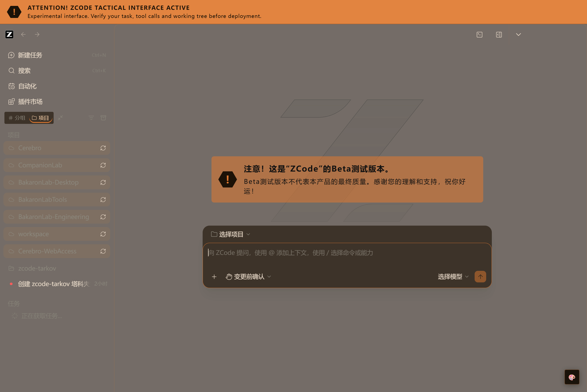
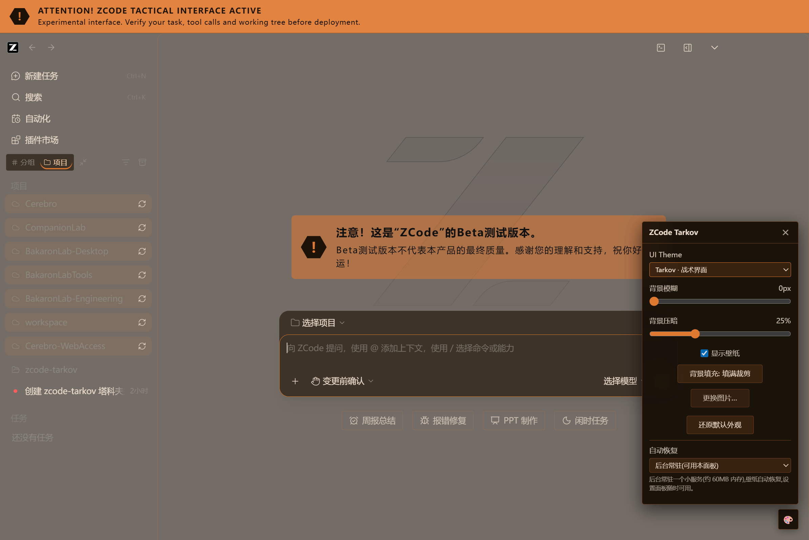

# zcode-tarkov

一套非官方的 Tarkov 风格主题，为 **ZCode 桌面客户端** 提供三种可随时切换的配色模式和一个壁纸层；按当前用户安装，从自带的 **ZCode Tarkov** 快捷方式启动，不会修改 ZCode 的任何文件。



> **非官方项目。** 本项目与 Battlestate Games（《Escape from Tarkov》的开发商与发行商）**没有任何隶属、背书或赞助关系**，与 ZCode 厂商亦无关联。仓库内**不包含任何游戏素材**——没有游戏图片、语音、Logo 或贴图。详见 [THIRD_PARTY_NOTICES.md](THIRD_PARTY_NOTICES.md)。

## 功能简介

主题通过本机调试端口（Chrome DevTools Protocol）向正在运行的 ZCode 窗口注入 CSS。ZCode 的安装文件不会被修改，主题也不会向其中写入任何内容。

三种配色模式，可随时在 ZCode 内置的设置面板中切换：

| 模式 | UI 配色的来源 | 壁纸 |
|---|---|---|
| **Monet** | 从你的壁纸提取（Material Design 3 动态取色） | 照常显示 |
| **Tarkov** | 固定的 Tarkov 风格配色：深棕底色上的强调橙 `#e07930`、暖色文字 `#e8d9c8` | 照常显示；壁纸不会影响 UI 颜色 |
| **Native** | 完全保留 ZCode 原生颜色 | 通过半透明覆盖层照常显示 |

三种模式都保留壁纸层：可以导入自己的图片、设置模糊与压暗、显示或隐藏壁纸，以及选择背景的填充方式。

Tarkov 模式还带有本项目的视觉语言：窗口顶部一条两行的测试版警示带；在空白主页上，问候语的位置会显示一条测试版提示（半透明橙色色带 + 深色六边形 `!` 徽标），页面原有的图形保持不动。

无论哪种模式，以下内容都不会被覆盖：ZCode 的功能性颜色（`success`、`warning`、`danger`、`git-*`、`diff-*`）以及代码块的语法配色。状态颜色保持可辨识，代码保持可读。

## 环境要求

- **Windows。** 安装脚本、启动器和快捷方式仅支持 Windows。
- **已安装 ZCode Desktop。** 本版本实测于 ZCode 3.11.2。
- **Node.js 20 或更高版本。** 安装脚本会在 `PATH`、`C:\Program Files\nodejs` 和 `%LOCALAPPDATA%\Programs\nodejs` 中查找 `node.exe`，找不到就拒绝安装。

不需要自行构建：`dist/` 中的打包产物已随仓库提交。

## 安装

在本仓库的检出目录中运行：

```powershell
powershell -NoProfile -ExecutionPolicy Bypass -File install.ps1
```

一次正式安装会完成以下事情：

- 把安装内容（CLI 打包产物、启动器脚本、`LICENSE`、`THIRD_PARTY_NOTICES.md` 和 `licenses/`）复制到 `%LOCALAPPDATA%\Programs\zcode-tarkov`；
- 自动定位 `ZCode.exe`（依次尝试 settings 缓存、ZCode 自带的环境变量、注册表 `App Paths`、已知路径，最后是有范围限制的扫描——绝不会递归扫描整个磁盘）；
- 在你的**桌面**和**开始菜单**各创建一个名为 **"ZCode Tarkov"** 的快捷方式；
- 注册当前用户的登录自启动项，让常驻主题服务在你登录后自动恢复，并立即启动该服务；
- 在安装目录写入 `settings.json`，供启动器读取。

整个过程都是**用户级**的：安装脚本绝不提权、绝不请求管理员权限，也不会写入 `C:\Program Files`、`%ProgramData%`、公共桌面或机器级注册表位置。它不会修改 ZCode 的安装文件，也不会创建、修改或删除 ZCode 的官方快捷方式。它写入的内容只有：安装目录、名为 `ZCode Tarkov.lnk` 的快捷方式，以及当前用户的登录自启动项。

常用参数：`-DryRun` 只报告将要做什么、不写入任何内容；`-CdpPort` / `-ApiPort` 修改两个本机端口（默认 `9222` / `9223`）；`-DataDir` 把主题数据放在你指定的目录；此外还有 `-InstallDir`、`-ShortcutDir`、`-NoShortcuts`、`-NoService`、`-Force` 和 `-Json`。退出码 `0` 表示安装完成（允许有警告），`1` 表示被拒绝或失败、没有安装任何东西。

仓库同时带有 ZCode 插件/市场（marketplace）打包文件（`marketplace.json`、`.zcode-plugin/plugin.json`）。这条安装路径对本分支**尚未验证**（本分支尚未发布到任何市场）；`install.ps1` 才是受支持、已验证的安装方式。

## 日常使用

**请始终从 "ZCode Tarkov" 快捷方式启动 ZCode**（桌面或开始菜单）。ZCode 只有在带本机调试端口启动时才能被主题化，而快捷方式正是负责这一点的入口。

快捷方式通过一个隐藏的启动器运行，不会闪出控制台窗口。每次启动时它会：

1. 定位 ZCode（优先使用缓存的路径，因此 ZCode 更新导致位置变化时会被发现并刷新缓存）；
2. 如果 ZCode 已经带着调试端口在运行，就保持不动；
3. 如果 ZCode 正在运行但**没有**主题所需的调试端口，会先询问是否可以重启 ZCode（未保存的会话内容会丢失）。如果你选择否，或调用方传入了 `-NoPrompt`，它不会做任何改动，只提示你完全退出 ZCode 后从快捷方式重新启动；
4. 否则带调试端口启动 ZCode；
5. 确认常驻主题服务健康；
6. 向 `launcher.log` 追加一行记录。

启动器唯一可能结束的进程就是 ZCode 本身，而且只在对话框中明确选择"是"之后。它采用失败软着陆：最坏的情况也只是 ZCode 在无主题的状态下启动。退出码：`0` 正常，`2` 降级（ZCode 可用但主题无法应用），`3` ZCode 正以无调试端口的方式运行，`4` 安装或 `settings.json` 不可用，`1` 意外错误。

### 切换主题

服务运行后，ZCode 窗口右下角会出现一个 🎨 按钮。点击它打开设置面板，其中可以：

- **UI Theme** —— Monet / Tarkov / Native，切换立即生效并被记住。
- **背景模糊** 与 **背景压暗** 滑块。
- **显示壁纸** 开关、**背景填充**方式（填满裁剪 / 完整显示 / 智能适配），以及**更换图片**按钮。
- **还原默认外观** —— 移除壁纸与配色覆盖。
- **自动恢复** —— 选择由谁在 ZCode 启动时把主题恢复回来，或保持常驻服务运行，或什么都不做。

本版本的设置面板文案为中文。

如果面板连不上主题服务，它会显示明确的离线提示和重试按钮，而不是渲染一套它从未读取过的数值。如果 ZCode 正以无调试端口的方式运行，面板会提示需要重启，并提供按钮正确地重启 ZCode。



## 保持更新

- **在检出目录中重新运行 `install.ps1`** 即可刷新已有安装。它是幂等的：会保留 `installedAt`、已记录的数据目录和缓存的 ZCode 路径，并且只删除属于它自己、而当前源码已不再提供的文件。
- **ZCode 更新之后，请运行 `repair.ps1`。** 它会重新定位 `ZCode.exe`（ZCode 更新可能改变安装路径）、重新解析 `node.exe`、校验安装内容、在已记录的目录中重建 "ZCode Tarkov" 快捷方式，并检查常驻服务。它还会报告 ZCode 更新可能破坏的三类接口：启动器、DOM 选择器和 CSS 变量。
- **`repair.ps1 -SourceDir <目录>`** 从另一份检出复制安装内容——这是就地升级的路径。`-RestartService` 会重启常驻服务，让刚复制进去的产物立即生效；此外还有 `-NoService`、`-NoShortcuts`、`-ZcodeExe`、`-ShortcutDir`、`-DryRun`、`-Force` 和 `-Json`。
- `repair.ps1` 不会改写已记录的端口；要更换端口请用 `install.ps1 -CdpPort ...`。
- `repair.ps1` 的退出码：`0` 一切正常或已修复，`2` 仍有降级项，`1` 无法修复。

## 卸载

运行 `uninstall.ps1`——可以用已安装的那份（`%LOCALAPPDATA%\Programs\zcode-tarkov\uninstall.ps1`），也可以用检出目录中的：

```powershell
powershell -NoProfile -ExecutionPolicy Bypass -File uninstall.ps1
```

它会停止本次安装的常驻服务、删除 CLI 注册的登录自启动项、删除它写入的 "ZCode Tarkov" 快捷方式，并移除安装目录。它是幂等的：第二次运行会把已经不存在的内容报告为 `[absent]`，并以 `0` 退出。

**数据目录默认保留**——里面是你的壁纸和设置。`uninstall.ps1` 会打印它的路径。`-RemoveData` 会额外删除 CLI 在该目录中拥有的文件（`config.json`、`config.backup.json`、`recovery.json`、`wallpaper.*`、`serve.log`、`launcher.log`），并且只有在目录里再无其他内容时才删除目录本身。

`uninstall.ps1` 绝不触碰 ZCode 的安装目录与用户数据、ZCode 的官方快捷方式、插件市场缓存（`%USERPROFILE%\.zcode\cli\plugins`），也不碰任何不属于本项目的快捷方式。它对官方条目唯一可能做的改动，是移除本项目早期 playtest 工具注入过的 `--remote-debugging-port` 参数（可能出现在官方快捷方式或 ZCode 自身的 HKCU 处理项中）——这些条目本身绝不会被删除。`-DryRun` 会完整报告计划而不写入任何内容。退出码 `0` 表示清理完成，`1` 表示有步骤被拒绝或失败、需要处理。

## 故障排查

| 现象 | 处理方式 |
|---|---|
| 主题没有生效 | 请从 **ZCode Tarkov** 快捷方式（桌面或开始菜单）启动 ZCode，而不是 ZCode 自带的图标。 |
| 使用快捷方式时 ZCode 已经在运行 | 完全退出 ZCode（包括托盘图标），再从快捷方式启动。调试端口在进程启动时固定，已经运行的实例无法被主题化。 |
| ZCode 软件更新后主题失效 | 运行 `repair.ps1`，它会重新定位 ZCode 并修复启动器。如果主题仍然不生效，通常是 ZCode 的 DOM 锚点或颜色变量发生了变化，需要更新的 zcode-tarkov——`repair.ps1` 会把这两项报告为 `dom-selectors` / `css-tokens`，且无法离线修复。 |
| 启动器报告端口被其他程序占用 | 换一个端口重新安装：`powershell -NoProfile -ExecutionPolicy Bypass -File install.ps1 -CdpPort 9333`。 |
| 需要查看日志 | `launcher.log` 位于安装目录（`%LOCALAPPDATA%\Programs\zcode-tarkov`）；若安装时用了 `-DataDir`，则位于数据目录。`serve.log` 位于数据目录——`uninstall.ps1` 会打印它解析到的路径，默认在 `%USERPROFILE%\.zcode\cli\plugins\data\` 之下。 |

## 边界与实话

- **非官方项目。** 与 Battlestate Games 或 ZCode 厂商没有隶属、背书或赞助关系。"Escape from Tarkov" 及相关标识归其所有者。
- **不含任何游戏素材。** 主题只包含 CSS、一套配色，以及由你自己提供图片的壁纸层——没有 Logo、贴图、音乐或语音。
- **通过调试端口注入 CSS。** 这不是官方扩展点，因此 ZCode 更新可能让主题失效，直到本项目跟进。第一步是运行 `repair.ps1`；面板的还原按钮始终能把外观恢复为默认。
- **实测于 ZCode 3.11.2。** 其他 ZCode 版本未经测试；主题依赖的 DOM 锚点和颜色变量是特定版本的事实。
- **生命周期脚本仅支持 Windows。** CLI 本身也能在 macOS 和 Linux 上运行，但那些平台上不涉及任何快捷方式逻辑。

## 来源与许可

MIT，见 [LICENSE](LICENSE)。本仓库是上游 **zcode-beautify** 项目（MIT）的本地分支：CDP 注入层、Monet 取色、壁纸层、设置面板与 MCP 接口均沿用其成果，而非重新实现。Tarkov 配色与警示带的视觉语言参考自 **dsh-theme-tarkov** 项目（MIT），仅作只读参考——未复制其任何代码、选择器或素材。

完整的来源说明与明确的素材排除清单见 [THIRD_PARTY_NOTICES.md](THIRD_PARTY_NOTICES.md)；两个上游的许可证均完整保留在 [`licenses/`](licenses/) 中。

## 面向开发者与验证

开发者文档——安装布局契约、DOM 实测记录、构建/测试/打包命令以及验证脚本——见 [docs/dev/README.md](docs/dev/README.md)。v0.1.0 刻意不做的内容见 [ROADMAP.md](ROADMAP.md)。`docs/dev/`、`tools/` 与 `evidence/` 下的所有内容都属于开发者与验证材料，不是用户文档。
